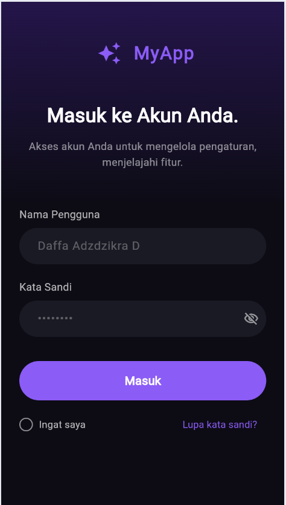
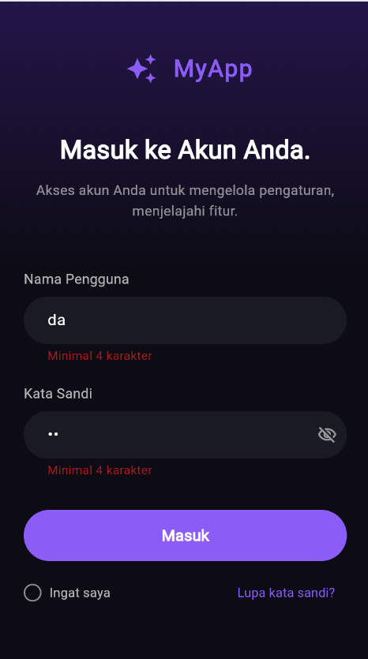
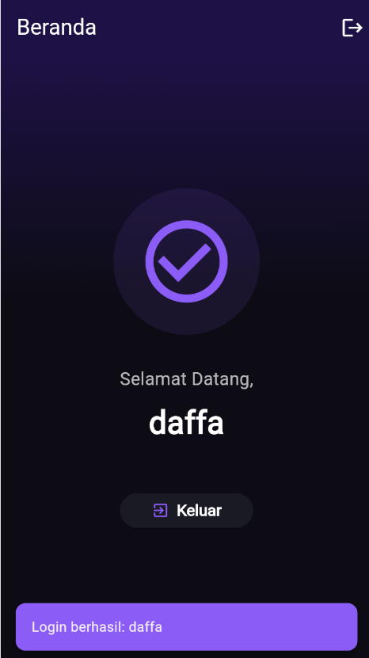

# Pertemuan 6 - 2306082 

Aplikasi Flutter ini merupakan hasil pengembangan (*refactoring*) dari modul praktikum "Pemrograman Mobile" Pertemuan 6. Fokus utama pembaruan ini adalah *redesign* antarmuka (UI) menjadi lebih elegan dengan tema *Dark Mode* modern (terinspirasi dari UI/UX kekinian seperti DeepSeek) dan pemisahan struktur file agar kode menjadi lebih rapi dan dapat diskala (*scalable*). Seluruh UI dalam versi terbaru ini juga telah sepenuhnya dilokalisasi ke dalam Bahasa Indonesia.

## 🚀 Fitur Utama

- **Premium Dark Mode UI**: Antarmuka form masuk (*login*) yang *eye-catching* dengan gradasi warna ungu-hitam, sudut objek yang membulat (rounded), serta perpaduan teks putih yang nyaman dibaca.
- **Form Validasi Keamanan**: 
  - Validasi *input* untuk memastikan isian 'Nama Pengguna' dan 'Kata Sandi' tidak kosong dan harus diisi lebih dari 4 karakter.
  - Sembunyikan (*obscure*) kata sandi dengan fitur ketuk ikon mata (*toggle visibility*).
- **Komponen Ekstra Interaktif**: Dilengkapi elemen seperti opsi "Ingat saya" (*checkbox*) dan "Lupa kata sandi?".
- **Sistem Navigasi Aman**: 
  - Berpindah mulus ke halaman **Beranda** (Home Page) dengan menyapa nama pengguna setelah lulus uji validasi.
  - Terdapat tombol **Keluar** (*Logout*) yang dilengkapi fungsional `Navigator.pushReplacement()`, bertujuan mencegah pengguna kembali mengakses halaman dalam / luar tanpa pengawasan dengan menahan tombol _Back_ OS.
- **Terjemahan Penuh**: Penggunaan Bahasa Indonesia di semua sisi komponen hingga elemen interaktifnya (contoh: *tooltip*).

## 📂 Struktur Proyek Terpisah

Kode sekarang dipecah untuk menunjang performa dan kerapian *Clean Code*:
```text
lib/
├── main.dart             # Penentu konfigurasi dasar aplikasi (Entry Point + Theme).
└── pages/
    ├── login_page.dart   # Logic validasi dan Antarmuka (UI) Halaman Masuk Utama.
    └── home_page.dart    # Antarmuka Halaman Beranda (Selamat Datang) dan fungsi Logout.
```

## 🛠️ Cara Menjalankan Proyek

Pastikan set lingkungan Flutter Anda sudah terkonfigurasi pada PC/Laptop.

1. **Unduh (Clone)** repositori (folder) ini.
2. **Arahkan Terminal** ke lokasi folder proyek:
   ```bash
   cd pertemuan6_2306082
   ```
3. **Instal Dependensi**:
   ```bash
   flutter pub get
   ```
4. **Jalankan Aplikasi** di Emulator/Smarphone:
   ```bash
   flutter run
   ```

## 📸 Tangkapan Layar (Screenshot)






